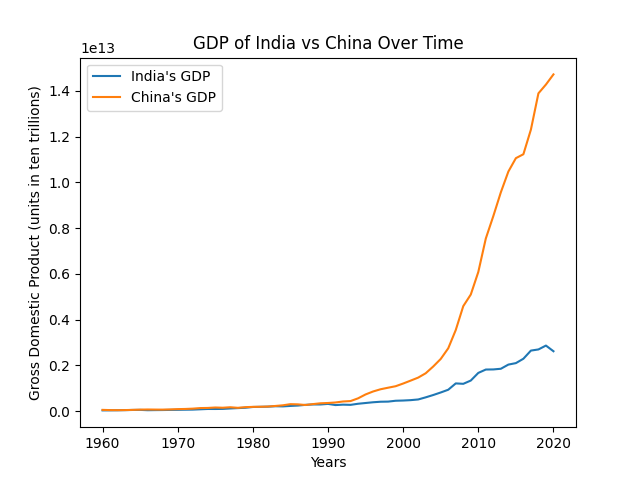
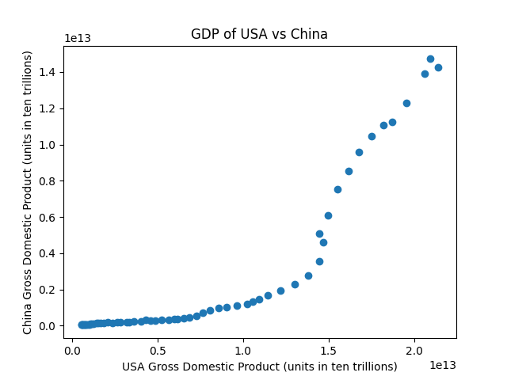

# hw_02
For HW#2 of CSCI040

# Aaryan's Visualizations!

## Project Instructions
* [Project Instructions](https://github.com/mikeizbicki/cmc-csci040/tree/2021fall/hw_02) return

## India vs China GDP Comparison (Line Plot)
1. **Data Source #1**: [India's GDP JSON](https://api.worldbank.org/v2/countries/IND/indicators/NY.GDP.MKTP.CD?per_page=5000&format=json)
2. **Data Source #2**: [China's GDP JSON](https://api.worldbank.org/v2/countries/CHN/indicators/NY.GDP.MKTP.CD?per_page=5000&format=json)

## USA vs China GDP Comparison (Scatter Plot)
1. **Data Source #1**: [USA's GDP JSON](https://api.worldbank.org/v2/countries/USA/indicators/NY.GDP.MKTP.CD?per_page=5000&format=json)
2. **Data Source #2**: [China's GDP JSON](https://api.worldbank.org/v2/countries/CHN/indicators/NY.GDP.MKTP.CD?per_page=5000&format=json)

